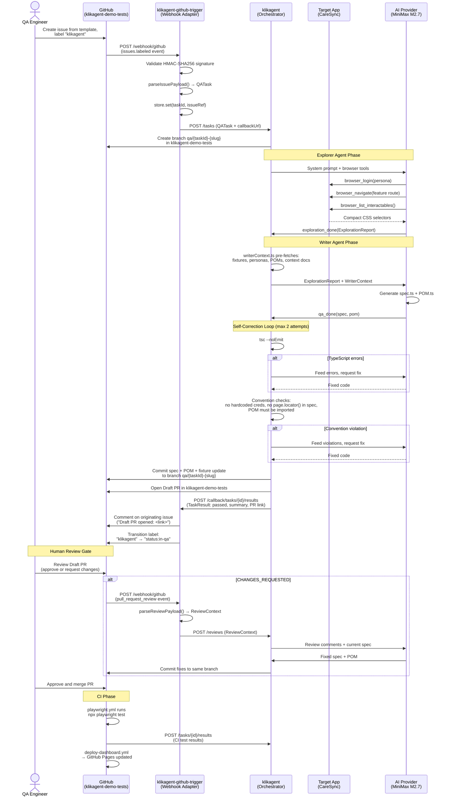

# KlikAgent — System Architecture

Full end-to-end flow across all three repositories.

---

## Sequence Diagram



---

## Data Flow Summary

### 1. Trigger (Issue → QATask)

```
GitHub issue (labeled "klikagent")
        │
        │  issues.labeled webhook event
        ▼
klikagent-github-trigger
        │  parseIssuePayload() extracts:
        │  - taskId (issue number)
        │  - title, description
        │  - qaEnvUrl (from issue body)
        │  - outputRepo (from issue body)
        │  - feature (from "feature:*" label)
        │
        │  POST /tasks
        ▼
{
  taskId: "42",
  title: "Test patient login flow",
  description: "Patient can log in and see their dashboard",
  qaEnvUrl: "https://app.testingwithekki.com",
  outputRepo: "klikagent-demo-tests",
  feature: "auth",
  callbackUrl: "http://trigger-host/callback/tasks/42/results"
}
```

### 2. Exploration (QATask → ExplorationReport)

```
QATask received
        │
        ▼
Explorer Agent (browser tools)
        │  logs in as persona
        │  navigates to feature routes
        │  collects locators + observed flows
        ▼
ExplorationReport {
  feature: "auth",
  visitedRoutes: ["/login", "/dashboard"],
  authPersona: "patient",
  locators: {
    "/login": {
      "emailInput": "page.getByTestId('email-input')",
      "passwordInput": "page.getByTestId('password-input')",
      "submitButton": "page.getByRole('button', { name: 'Sign In' })"
    }
  },
  flows: [{ steps: [...], observedBehavior: "redirects to /dashboard" }],
  notes: ["Login form uses test-id attributes"]
}
```

### 3. Generation (ExplorationReport → spec + POM)

```
ExplorationReport + WriterContext
        │
        ▼
Writer Agent (code generation)
        │  reads existing POMs, fixtures, context docs
        │  generates spec using POM pattern
        │  imports personas from fixtures (never hardcodes)
        ▼
spec: tests/web/auth/42.spec.ts
pom:  pages/auth/AuthPage.ts
fixture update: fixtures/index.ts (new import)
```

### 4. Self-Correction (code → validated code)

```
Generated code
        │
        ├── tsc --noEmit ──────────── errors? → feed back, retry
        │
        └── Convention checks:
            ├── no raw email/password in spec?
            ├── no page.locator() in spec?
            └── POM imported and used?
                         │
                         └── violation? → feed back, retry (max 2 attempts)
```

### 5. Output (validated code → Draft PR)

```
Validated spec + POM
        │
        ├── git commit to branch qa/42-test-patient-login
        └── Draft PR opened in klikagent-demo-tests
                │
                └── POST /callback/tasks/42/results
                        │
                        └── klikagent-github-trigger
                                ├── comments on issue #42
                                └── label: klikagent → status:in-qa
```

### 6. CI Feedback (test run → results)

```
PR merged (or CI triggered on PR)
        │
        ▼
playwright.yml
        │  npx playwright test
        │  node utils/update-dashboard.js
        ▼
POST /tasks/42/results → klikagent
        │
        └── (Phase 3) patch loop on failure
```

---

## Interface Contracts Between Repos

### klikagent-github-trigger → klikagent

`POST /tasks`
```typescript
QATask {
  taskId: string
  title: string
  description: string
  qaEnvUrl: string
  outputRepo: string
  feature?: string
  callbackUrl?: string
  metadata?: Record<string, unknown>
}
```

`POST /reviews`
```typescript
ReviewContext {
  prNumber: number
  repo: string
  outputRepo: string
  branch: string
  ticketId: string
  reviewId: number
  reviewerLogin: string
  comments: ReviewComment[]
  specPath: string
}
```

### klikagent → klikagent-github-trigger

`POST /callback/tasks/:id/results`
```typescript
TaskResult {
  taskId: string
  passed: boolean
  summary: string
  reportUrl?: string
  metadata?: Record<string, unknown>
}
```

### klikagent-demo-tests CI → klikagent

`POST /tasks/:id/results`
```typescript
{
  taskId: string
  passed: boolean
  failedTests?: string[]
  errorOutput?: string
  reportUrl?: string
}
```

---

## Component Responsibilities

| Component | Owns | Does NOT own |
|---|---|---|
| `klikagent-github-trigger` | HMAC validation, GitHub event parsing, issue label transitions, callback dispatch | AI logic, browser automation, code generation |
| `klikagent` | Agent pipeline, self-correction, branch/PR management, AI orchestration | GitHub webhook validation, CI execution |
| `klikagent-demo-tests` | Test execution, dashboard hosting, issue template, CI workflows | Agent logic, orchestration |

---

## Key Design Decisions

**Provider-agnostic core** — KlikAgent only knows `QATask`. Swap the trigger adapter (GitHub → Jira → Linear) without touching the orchestrator.

**Two-agent pipeline with clean handoff** — Explorer (browser-heavy, expensive) produces a structured `ExplorationReport`. Writer (context-heavy, cheap) consumes it. Clear boundary enables parallelization and independent testing.

**Human-in-the-loop is load-bearing** — Draft PRs are mandatory. QA engineers review before anything merges. The system produces candidates, not final tests.

**Self-correction before commit** — TypeScript validation and convention checks run in a loop before any code reaches the repo. Reduces noise in PRs.

**Token efficiency** — `browser_list_interactables()` returns compact CSS selectors only (no screenshots, no DOM dump). ~70% fewer tokens per browser session vs. alternatives.
