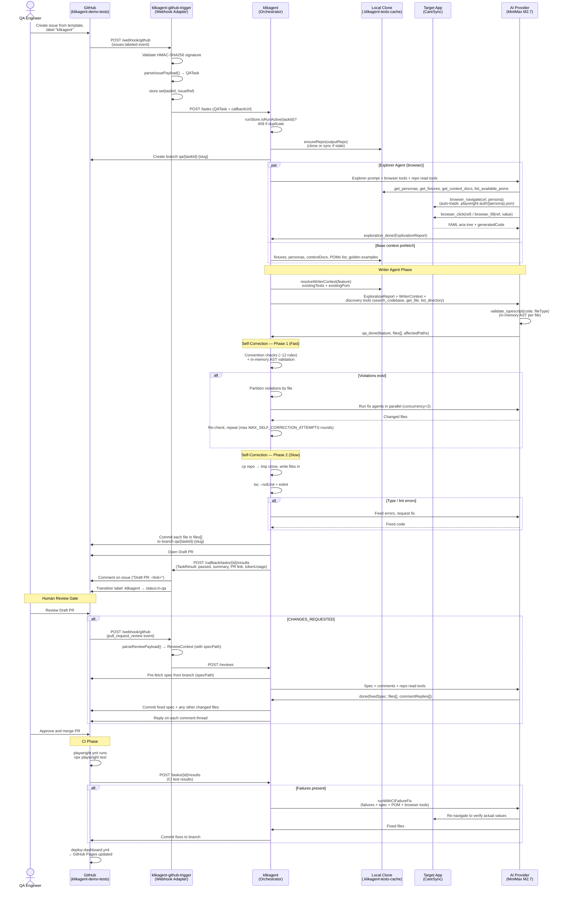

# KlikAgent — System Architecture

Full end-to-end flow across all three repositories.

---

## Sequence Diagram



---

## Endpoints

All endpoints live on `src/webhook/server.ts`. There is **no** `/webhook/github` route here — HMAC validation and GitHub parsing live in `klikagent-github-trigger`.

| Method | Path | Description |
|---|---|---|
| `POST` | `/tasks` | Trigger QA spec generation. Accepts `QATask`. 202 Accepted, processes async. |
| `POST` | `/reviews` | Trigger Review Agent on a CHANGES_REQUESTED PR review. Accepts `ReviewContext`. |
| `POST` | `/tasks/:id/results` | CI reports Playwright test results back. |
| `POST` | `/repos/provision` | Scaffold a new convention-compliant test repo (creates GitHub repo, seeds context). |
| `GET` | `/health` | Health check. |
| `GET` | `/dashboard` | Live dashboard UI with SSE event stream. |

Duplicate-task protection: `POST /tasks` returns 409 if `runStore.isRunActive(taskId)`. Same for `/reviews` (`pr-{n}`) and `/repos/provision` (`provision-{repoName}`).

---

## Data Flow Summary

### 1. Trigger (Issue → QATask)

```
GitHub issue (labeled "klikagent")
        │  issues.labeled webhook
        ▼
klikagent-github-trigger
        │  parseIssuePayload() extracts taskId, title, description,
        │  qaEnvUrl, outputRepo, optional feature
        │
        │  POST /tasks
        ▼
{
  taskId: "42",
  title: "Test patient login flow",
  description: "Patient can log in and see their dashboard",
  qaEnvUrl: "https://app.testingwithekki.com",
  outputRepo: "klikagent-demo-tests",
  feature: "auth",
  callbackUrl: "http://trigger-host/callback/tasks/42/results"
}
```

### 2. Local clone & branch prep

```
ensureRepo(outputRepo)
        │  clone if missing → ./.klikagent-tests-cache/{repoName}/
        │  fetch + reset --hard origin/{default} if last sync > 5 min
        │  npm ci if node_modules missing
        ▼
git branch qa/{taskId}-{slug}  (via GitHub API)
```

### 3. Exploration (parallel with base-context prefetch)

```
QATask + repoName
        │
        ├──► runExplorerAgent (browser + repo read tools)
        │       browser_navigate(url, persona="patient")  ← auto-loads .playwright-auth/patient.json
        │       browser_click(ref) / browser_fill(ref, value)
        │       browser_generate_locator(ref) for non-interacted elements
        │       Persona auto-switches mid-session if a different persona is requested
        │       → exploration_done(ExplorationReport)
        │
        └──► prefetchBaseContext (overlaps with exploration)
                fixtures/index.ts, config/personas.ts,
                context/*.md, all POMs in pages/,
                goldenExamples (7 pattern snippets)
```

```typescript
ExplorationReport {
  feature: "auth",
  visitedRoutes: ["/login", "/dashboard"],
  authPersona: "patient",
  locators: {
    "/login": {
      "emailInput":    "page.getByTestId('email-input')",
      "passwordInput": "page.getByTestId('password-input')",
      "submitButton":  "page.getByRole('button', { name: 'Sign In' })"
    }
  },
  flows: [{ name, steps, observed }],
  missingLocators: [{ route, name, reason }],
  notes: ["…"]
}
```

### 4. Generation (Writer reads report + WriterContext, no browser)

```
ExplorationReport + resolveWriterContext(feature, baseCtx)
        │
        ▼
runWriterAgent
        Tools available:
          validate_typescript({ code, fileType })  (in-memory AST per file)
          search_codebase, get_file, list_directory  (on-demand discovery)
          done(feature, files[], affectedPaths)
        │
        ▼
files[] = [
  { path: "tests/web/auth/auth.spec.ts",   content, role: "spec" },
  { path: "pages/auth/AuthPage.ts",        content, role: "pom"  },
  ...optional fixture / extra files
]
```

### 5. Self-Correction (two-phase)

```
files[]
   │
   ├── Phase 1 (Fast) ────────────────────────────────────────────
   │   Convention checks (regex/AST, ~12 rules) on each file
   │   + in-memory ts.createSourceFile validation
   │   │
   │   └─► If any violations: partition by target file,
   │       run fix agents in parallel (concurrency = 2),
   │       merge results, re-check.
   │       Up to MAX_SELF_CORRECTION_ATTEMPTS rounds (default 10).
   │
   └── Phase 2 (Slow) — only if Phase 1 clean ───────────────────
       cp local clone → /tmp, symlink node_modules,
       write files[] in, run:
         tsc --noEmit         (parsed errors filtered to generated files)
         eslint --format json
       │
       └─► If errors: feed to fix agent, re-validate,
           up to MAX_SELF_CORRECTION_ATTEMPTS attempts.

If all attempts exhausted → commit anyway, set warned=true,
include warningMessage in TaskResult metadata.
```

**Convention rules currently enforced:**

| Rule | Where |
|---|---|
| No `page.locator` / `page.getBy*` directly in spec | Spec only (must go through POM) |
| No hardcoded persona display names / emails / non-credential fields | Spec + POM |
| No hardcoded persona email passed to `.login(...)` | Spec |
| `personas.X.Y` references must match the actual personas schema | Spec |
| No manual `new XxxPage(page)` POM construction | Spec |
| No module-level `let xxxPage: XxxPage` declarations | Spec |
| No `beforeEach` login (use persona fixtures) | Spec |
| No bare `{ page, ... }` fixture destructuring | Spec |
| No Jest `test.each()` / `describe.each()` | Spec |
| Feature POMs must NOT be registered as fixtures | Structural |
| Spec POM imports must use `../../../pages/...` (3 levels up) | Structural |
| Spec must import the generated POM and use it | Spec |

Comments, test descriptions, route paths, fixture parameter names, and URL regex patterns are stripped from spec content before the forbidden-string check runs (false-positive prevention).

### 6. Output (validated files → Draft PR)

```
Validated files[]
   │
   ├── For each file: commitFile(repo, branch, path, content)
   │       commit msg: "feat({role}): {path} for #{taskId} [klikagent]"
   ├── openPR(repo, branch, "[QA] #{taskId} {title}", body)
   └── POST /callback/tasks/{id}/results
           TaskResult { taskId, passed: !warned, summary, reportUrl: prUrl,
                        metadata: { tokenUsage, warned, warningMessage } }
```

### 7. CI Feedback (test run → results)

```
PR merged or CI runs on PR
        │  playwright.yml: npx playwright test
        ▼
POST /tasks/{id}/results { passed, failedTests[], errorOutput }
        │
        ▼
runWithCiFailureFix (when failures present)
        Browser tools available — re-navigates to verify
        actual heading text / locator counts before fixing.
        Deduplicates failures (max 5), trims stack traces.
        │
        ▼
Commit fixed spec/POM to same branch, run TS validation pass.
```

---

## Interface Contracts

### klikagent-github-trigger → klikagent

`POST /tasks`
```typescript
QATask {
  taskId: string
  title: string
  description: string
  qaEnvUrl: string
  outputRepo: string
  feature?: string
  callbackUrl?: string
  metadata?: Record<string, unknown>
}
```

`POST /reviews`
```typescript
ReviewContext {
  prNumber: number
  repo: string                // backwards-compat
  outputRepo: string          // canonical — always use this
  branch: string
  ticketId: string
  reviewId: number
  reviewerLogin: string
  comments: ReviewComment[]   // pre-fetched at trigger
  specPath: string            // e.g. "tests/web/auth/qa-auth-flow.spec.ts"
}
```

`POST /repos/provision`
```typescript
ProvisionRequest {
  repoName: string
  owner: string
  qaEnvUrl: string
  features: string[]
  domainContext: string
  personas?: Record<string, PersonaSeed>
}
```

### klikagent → klikagent-github-trigger

`POST /callback/tasks/:id/results`
```typescript
TaskResult {
  taskId: string
  passed: boolean              // false when self-correction warned
  summary: string
  reportUrl?: string           // PR link
  metadata?: {
    tokenUsage: { promptTokens, completionTokens, totalTokens, costUSD },
    warned: boolean,
    warningMessage?: string,
  }
}
```

### klikagent-demo-tests CI → klikagent

`POST /tasks/:id/results`
```typescript
{
  taskId: string
  passed: boolean
  failedTests?: CiTestFailure[]   // testName, errorMessage, filePath?
  errorOutput?: string
  reportUrl?: string
}
```

### Internal: Explorer → Writer handoff

```typescript
ExplorationReport {
  feature: string
  visitedRoutes: string[]
  authPersona: string
  locators: Record<string, Record<string, string>>   // route → name → generatedCode
  flows: ObservedFlow[]                              // { name, steps, observed }
  missingLocators: MissingLocator[]                  // { route, name, reason }
  notes: string[]
}

WriterContext {
  fixtures: string                          // fixtures/index.ts
  personas: string                          // config/personas.ts
  contextDocs: string                       // joined context/*.md
  availablePoms: string[]                   // all POM paths in repo
  existingTests: Record<string, string>     // tests/web/{feature}/*.spec.ts
  existingPom: string | null                // pages/{feature}/*Page.ts (first match)
  goldenExamples: string                    // 7 pattern snippets
}

FileEntry {
  path: string
  content: string
  role: 'spec' | 'pom' | 'fixture' | 'extra'
}
```

---

## Component Responsibilities

| Component | Owns | Does NOT own |
|---|---|---|
| `klikagent-github-trigger` | HMAC validation, GitHub event parsing, issue label transitions, callback dispatch, comment fetching for reviews | AI logic, browser automation, code generation, repo state |
| `klikagent` | Local repo cache, agent pipeline (Explorer + Writer + Review + CI fix), self-correction (2-phase), branch / PR / commit operations, repo provisioning, dashboard event bus | Webhook validation, CI execution |
| `klikagent-demo-tests` | Test execution (Playwright), persona storageState fixtures, dashboard hosting (GitHub Pages), issue template, CI workflows | Agent logic, orchestration |

---

## Local Repo Cache

`src/services/localRepo.ts` maintains a local clone per output repo. **All repo reads — Explorer context, Writer context, Review agent context, CI fix agent context — go through it**, not the GitHub API.

| Setting | Default | Notes |
|---|---|---|
| Clone root | `./.klikagent-tests-cache/{repoName}/` | Override with `KLIKAGENT_TESTS_LOCAL_PATH` |
| Sync interval | 5 minutes | Override with `LOCAL_REPO_SYNC_INTERVAL_MS` |
| Auth | GitHub App installation token (with `GITHUB_TOKEN` fallback) | Used for the clone URL |
| Sync command | `git fetch origin && git reset --hard origin/{default}` | After interval expires |

`prepareTempClone()` in `codeValidation.ts` creates a separate temp copy per validation run, symlinks `node_modules`, writes the generated files in, and runs `tsc` / `eslint` against the result.

---

## Authentication

GitHub App auth (replaces the earlier PAT flow). JWT is signed with native `crypto.createSign('RSA-SHA256')` — no `@octokit/auth-app` dependency.

| Env var | Used for |
|---|---|
| `GH_APP_ID` | App identifier in JWT `iss` |
| `GH_PRIVATE_KEY` | RSA private key (newlines escaped as `\n`) |
| `GH_INSTALLATION_ID` | Installation token exchange |
| `GITHUB_TOKEN` | Fallback PAT for `localRepo` clone if App vars missing |
| `GITHUB_OWNER` | Org / user that owns the output repo |

Installation tokens are minted on each `ghRequest()` call; no in-memory caching.

---

## Persona Auth Model (target test repo)

Provisioned repos ship with `global-setup.ts` that logs in as each persona once and saves storageState to `.playwright-auth/{persona}.json`. The fixtures file exposes:

- `authPage` — fresh `Page` with the `AuthPage` POM constructed. Use only for login-page tests.
- `asPatient` / `asDoctor` / `asAdmin` — pre-authenticated `Page` objects (no login boilerplate). Use for feature tests; construct feature POMs inline from the persona page.

This is enforced by convention checks: `beforeEach` login patterns, manual POM construction with `new XPage(page)`, module-level POM `let` declarations, and bare `{ page }` fixture destructuring all fail validation.

---

## Tool Surfaces by Agent

| Agent | Browser tools | Repo read tools | Discovery tools | validate_typescript | done() shape |
|---|:-:|:-:|:-:|:-:|---|
| Explorer | ✅ | ✅ | — | — | `exploration_done(ExplorationReport)` |
| Writer | — | — | ✅ (`search_codebase`, `get_file`, `list_directory`) | ✅ | `qa_done(feature, files[], affectedPaths)` |
| Review | — | ✅ | — | ✅ | `done(fixedSpec, files[], commentReplies[])` |
| Convention/TS Fix | — | — | — | ✅ | `done(files[])` (changed files only) |
| CI Fix | ✅ | ✅ | — | ✅ | `done(files[])` |

All `done()` payloads use the unified `FileEntry` schema (`role: spec | pom | fixture | extra`).

---

## Multi-Tenant Browser Sessions

`browserTools.ts` derives a session id from `dashboardBus.getRunId()` (`run-{taskId}`). Two concurrent tasks therefore use independent playwright-cli sessions and never share state.

- `activeSessions: Set<string>` — open sessions
- `sessionPersona: Map<string, string>` — current persona per session

When `browser_navigate(url, persona)` is called with a different persona than the session currently holds, the saved storageState is loaded inline (no manual logout/login required). Sessions are torn down on `browser_close` and at the end of each run.

---

## Dashboard

`/dashboard` serves a static HTML page that subscribes to a Server-Sent Events stream. Every step of the pipeline (`github`, `agent`, `validation`, `correction`, `tools`) emits structured events via `dashboardBus.emitEvent(channel, level, message, payload)`. `runStore` retains the last N runs in-memory (cleared on restart).

---

## Key Design Decisions

**Provider-agnostic core.** KlikAgent only knows `QATask`. The trigger adapter (GitHub today, Jira/Linear later) is the only piece that speaks the source system's language.

**Two-agent pipeline with structured handoff.** The Explorer runs the expensive browser work and emits an `ExplorationReport`. The Writer is browser-free and consumes that report alongside a pre-fetched `WriterContext`. Base context prefetch overlaps with browser exploration for free latency wins.

**Local repo cache, not GitHub API.** Reading via the GitHub API for every fixture / persona / POM lookup was slow and rate-limit-prone. The local clone gives sub-millisecond reads, lets us run `tsc` and `eslint` against the real project, and powers on-demand `search_codebase` / `get_file` discovery for the Writer.

**Two-phase self-correction.** Fast in-process checks catch the obvious mistakes cheaply (regex + AST). Only if those pass do we pay the cost of a real `tsc` and `eslint` run in a temp clone. Convention fixes parallelize per-target-file with bounded concurrency, so a multi-violation run finishes in one round-trip per file rather than serializing.

**Human-in-the-loop is load-bearing.** Draft PRs are mandatory. Self-correction warnings still produce a PR, but flag `passed: false` in the callback so the trigger can mark the issue accordingly. Reviewer feedback round-trips via `POST /reviews` with the spec pre-fetched and the comments pre-resolved.

**Files[] schema everywhere.** Every agent that emits code uses `FileEntry { path, content, role }`. The orchestrator commits the array as-is — no special-casing spec vs. POM vs. fixture, no separate `pomPath` argument to keep in sync.

**Convention enforcement is opinionated and exhaustive.** The personas / POM / fixture conventions are encoded in regex + AST checks, not just prompt rules. Prompts get violated; checks don't. The list keeps growing: every category of "AI generated something silly" we observe in production becomes a check.

**Token efficiency.** `playwright-cli` returns a YAML accessibility tree with element refs (`e1`, `e2`, …) plus per-action `generatedCode` — no screenshots, no DOM dumps. Tool results are cached within a run (duplicate `get_personas` etc. return `[ALREADY FETCHED]`), and `done()` / `validate_typescript` are explicitly never cached.
